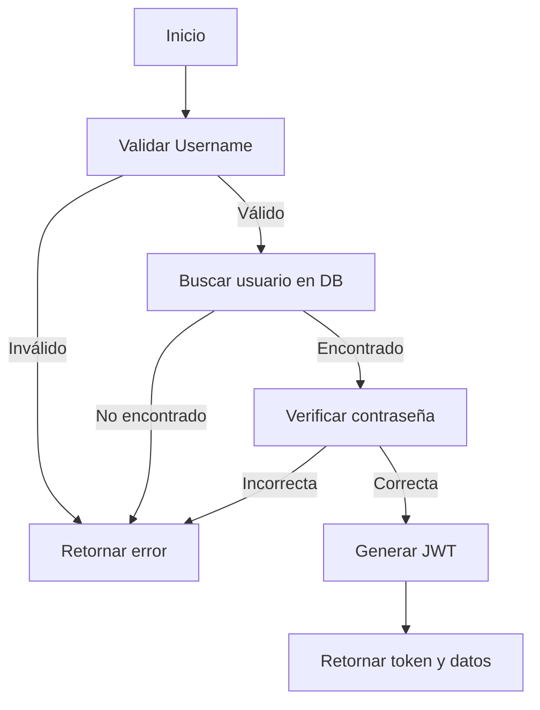

# Flujo de Login en UserRepository.cs

Este documento explica el flujo de autenticación implementado en el método `Login` de la clase `UserRepository` y detalla cada paso, haciendo especial foco en la generación del JWT (JSON Web Token).

## 1. Validación de datos de entrada

El método comienza verificando que el nombre de usuario (`Username`) no esté vacío:

```csharp
if (string.IsNullOrEmpty(userLoginDto.Username))
```

Si está vacío, retorna una respuesta indicando que el usuario es inválido.

## 2. Búsqueda del usuario en la base de datos

Se busca el usuario en la base de datos usando el nombre de usuario, ignorando mayúsculas/minúsculas y espacios:

```csharp
var user = await _db.Users.FirstOrDefaultAsync(user => user.Username.ToLower().Trim() == userLoginDto.Username.ToLower().Trim());
```

Si no se encuentra, retorna una respuesta indicando usuario inválido.

## 3. Verificación de la contraseña

Se verifica la contraseña usando BCrypt:

```csharp
if(!BCrypt.Net.BCrypt.Verify(userLoginDto.Password, user.Password))
```

Si la contraseña no coincide, retorna una respuesta indicando contraseña inválida.

## 4. Generación del JWT

Si el usuario y la contraseña son válidos, se genera el token JWT:

### a. Instancia del manejador de tokens

```csharp
var handlerToken = new JwtSecurityTokenHandler();
```

Permite crear y escribir el token.

### b. Validación de la clave secreta

```csharp
if (string.IsNullOrWhiteSpace(secretKey))
    throw new InvalidOperationException("Secret key is not configured.");
```

La clave secreta es fundamental para firmar el token y garantizar su integridad y autenticidad.

### c. Preparación de la clave

```csharp
var key = Encoding.UTF8.GetBytes(secretKey);
```

Convierte la clave secreta en un arreglo de bytes para usarla en la firma.

### d. Definición del descriptor del token

```csharp
var tokenDescriptor = new SecurityTokenDescriptor
{
    Subject = new ClaimsIdentity([
        new Claim("id", user.Id.ToString()),
        new Claim("username", user.Username),
        new Claim(ClaimTypes.Role, user.Role ?? string.Empty)
    ]),
    Expires = DateTime.UtcNow.AddHours(2),
    SigningCredentials = new SigningCredentials(new SymmetricSecurityKey(key), SecurityAlgorithms.HmacSha256Signature)
};
```

- **Claims:** Información que se incluirá en el token (id, username, role).
- **Expires:** Fecha de expiración del token (2 horas).
- **SigningCredentials:** Firma el token usando la clave secreta y el algoritmo HMAC SHA256.

### e. Creación y escritura del token

```csharp
var token = handlerToken.CreateToken(tokenDescriptor);
Token = handlerToken.WriteToken(token);
```

Se crea el token y se convierte a string para enviarlo al cliente.

## 5. Retorno de la respuesta

Se retorna un objeto con el token, los datos del usuario y un mensaje de éxito.

---

## Revisión de la implementación

- El flujo es correcto y seguro: valida usuario, contraseña y genera un JWT firmado.
- La clave secreta debe estar bien protegida y configurada.
- El uso de claims permite incluir información relevante en el token.
- El token tiene expiración, lo que mejora la seguridad.
- Se recomienda no retornar la contraseña del usuario en la respuesta, aunque esté cifrada.

## Recomendación

Para mayor seguridad, elimina la propiedad `Password` del objeto retornado en la respuesta:

```csharp
User = new UserRegisterDto()
{
    Username = user.Username,
    Name = user.Name,
    Role = user.Role
    // No incluir Password
}
```

---

## Diagrama del flujo de login



---

## Ejemplo de respuesta exitosa

```json
{
  "token": "eyJhbGciOiJIUzI1NiIsInR5cCI6IkpXVCJ9...",
  "user": {
    "username": "usuario1",
    "name": "Juan Perez",
    "role": "admin"
  },
  "message": "Login successful"
}
```
